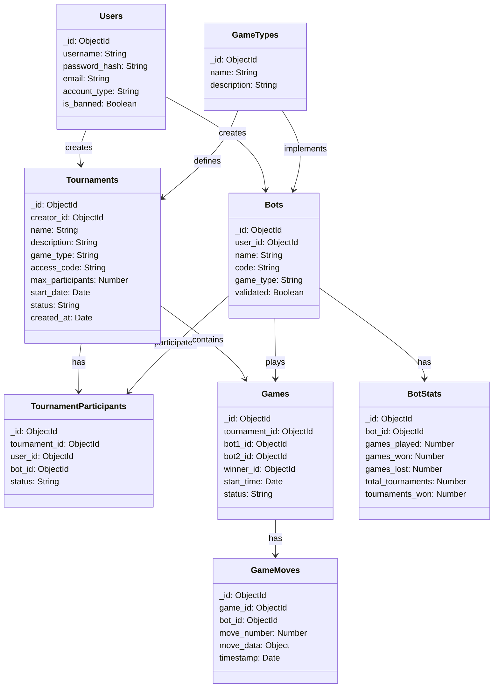

```mermaid
classDiagram
    class Users {
        _id: ObjectId
        username: String
        password_hash: String
        email: String
        account_type: String
        is_banned: Boolean
    }

    class Bots {
        _id: ObjectId
        user_id: ObjectId
        name: String
        code: String
        game_type: String
        validated: Boolean
    }

    class Tournaments {
        _id: ObjectId
        creator_id: ObjectId
        name: String
        description: String
        game_type: String
        access_code: String
        max_participants: Number
        start_date: Date
        status: String
        created_at: Date
    }

    class TournamentParticipants {
        _id: ObjectId
        tournament_id: ObjectId
        user_id: ObjectId
        bot_id: ObjectId
        status: String
    }

    class Games {
        _id: ObjectId
        tournament_id: ObjectId
        bot1_id: ObjectId
        bot2_id: ObjectId
        winner_id: ObjectId
        start_time: Date
        status: String
    }

    class GameMoves {
        _id: ObjectId
        game_id: ObjectId
        bot_id: ObjectId
        move_number: Number
        move_data: Object
        timestamp: Date
    }

    class GameTypes {
        _id: ObjectId
        name: String
        description: String
    }

    class BotStats {
        _id: ObjectId
        bot_id: ObjectId
        games_played: Number
        games_won: Number
        games_lost: Number
        total_tournaments: Number
        tournaments_won: Number
    }

    Users --> Bots : creates
    Users --> Tournaments : creates
    Tournaments --> TournamentParticipants : has
    Bots --> TournamentParticipants : participates
    Tournaments --> Games : contains
    Games --> GameMoves : has
    Bots --> Games : plays
    GameTypes --> Tournaments : defines
    GameTypes --> Bots : implements
    Bots --> BotStats : has
```